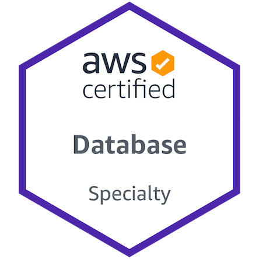
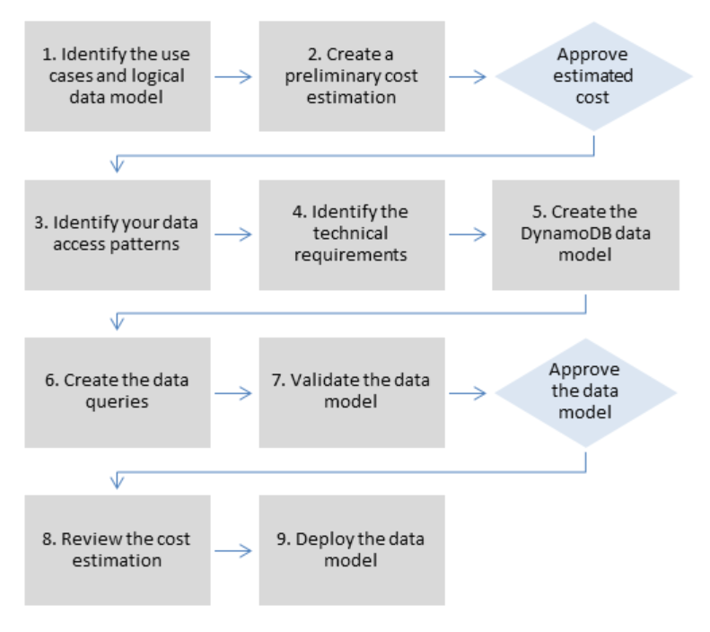
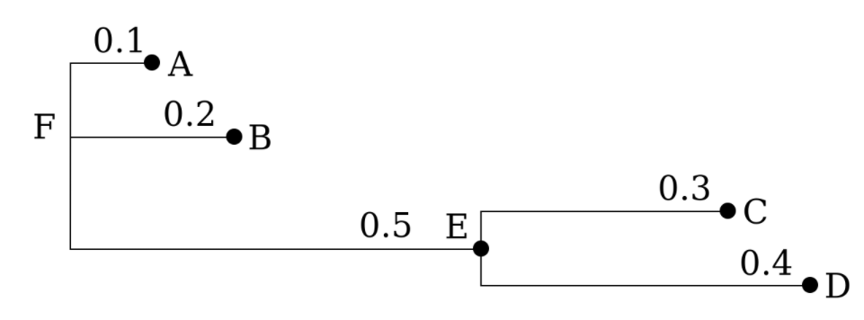

# TIL
Today I Learned - a repository of things I learned today, with links and examples.

# 13 of December
```
I'm on vacation! I'm on vacation! I'm on vacation! I'm on vacation! I'm on vacation! I'm on vacation! I'm on vacation! I'm on vacation! I'm on vacation! I'm on vacation! I'm on vacation! I'm on vacation! I'm on vacation! I'm on vacation! I'm on vacation! I'm on vacation! I'm on vacation! I'm on vacation! I'm on vacation! I'm on vacation! I'm on vacation! I'm on vacation! I'm on vacation! I'm on vacation! I'm on vacation! I'm on vacation! I'm on vacation! I'm on vacation! I'm on vacation! I'm on vacation! I'm on vacation! I'm on vacation! I'm on vacation! I'm on vacation! I'm on vacation! I'm on vacation! I'm on vacation! I'm on vacation! I'm on vacation! I'm on vacation! I'm on vacation! I'm on vacation! I'm on vacation! I'm on vacation! I'm on vacation! I'm on vacation! I'm on vacation! I'm on vacation! I'm on vacation! I'm on vacation! I'm on vacation! I'm on vacation! I'm on vacation! I'm on vacation! I'm on vacation! I'm on vacation! I'm on vacation! I'm on vacation! I'm on vacation! I'm on vacation! I'm on vacation! I'm on vacation! I'm on vacation! I'm on vacation! I'm on vacation! I'm on vacation! I'm on vacation! I'm on vacation! I'm on vacation! I'm on vacation! I'm on vacation! I'm on vacation! I'm on vacation! I'm on vacation! I'm on vacation! I'm on vacation! I'm on vacation! I'm on vacation! I'm on vacation! I'm on vacation! I'm on vacation! I'm on vacation! I'm on vacation! I'm on vacation! I'm on vacation! I'm on vacation! I'm on vacation! I'm on vacation! I'm on vacation! I'm on vacation! I'm on vacation! I'm on vacation! I'm on vacation! I'm on vacation! I'm on vacation! I'm on vacation! I'm on vacation! I'm on vacation! I'm on vacation! I'm on vacation! I'm on vacation! I'm on vacation! I'm on vacation! I'm on vacation! I'm on vacation! I'm on vacation! I'm on vacation! I'm on vacation! I'm on vacation! I'm on vacation! I'm on vacation! I'm on vacation! I'm on vacation! I'm on vacation! I'm on vacation! I'm on vacation! I'm on vacation! I'm on vacation! I'm on vacation! I'm on vacation! I'm on vacation! I'm on vacation! I'm on vacation! I'm on vacation! I'm on vacation! I'm on vacation! I'm on vacation! I'm on vacation! I'm on vacation! I'm on vacation! I'm on vacation! I'm on vacation! I'm on vacation! I'm on vacation! I'm on vacation! I'm on vacation! I'm on vacation! I'm on vacation! I'm on vacation! I'm on vacation! I'm on vacation! I'm on vacation! I'm on vacation! I'm on vacation! I'm on vacation! I'm on vacation! I'm on vacation! I'm on vacation! I'm on vacation! I'm on vacation! I'm on vacation! I'm on vacation! I'm on vacation! I'm on vacation! I'm on vacation! I'm on vacation! I'm on vacation! I'm on vacation! I'm on vacation! I'm on vacation! I'm on vacation! I'm on vacation! I'm on vacation! I'm on vacation! I'm on vacation! I'm on vacation! I'm on vacation! I'm on vacation! I'm on vacation! I'm on vacation! I'm on vacation! I'm on vacation! I'm on vacation! I'm on vacation! I'm on vacation! I'm on vacation! I'm on vacation! I'm on vacation! I'm on vacation! I'm on vacation! I'm on vacation! I'm on vacation! I'm on vacation! I'm on vacation! I'm on vacation! I'm on vacation! I'm on vacation! I'm on vacation! I'm on vacation! I'm on vacation! I'm on vacation! I'm on vacation! I'm on vacation! I'm on vacation! I'm on vacation! I'm on vacation! I'm on vacation! I'm on vacation! I'm on vacation! I'm on vacation! I'm on vacation! I'm on vacation! I'm on vacation! I'm on vacation! I'm on vacation! I'm on vacation! I'm on vacation! I'm on vacation! I'm on vacation! I'm on vacation! I'm on vacation! I'm on vacation! I'm on vacation! I'm on vacation! I'm on vacation! I'm on vacation! I'm on vacation! I'm on vacation! I'm on vacation! I'm on vacation! I'm on vacation! I'm on vacation! I'm on vacation! I'm on vacation! I'm on vacation! I'm on vacation! I'm on vacation! I'm on vacation! I'm on vacation! I'm on vacation! I'm on vacation! I'm on vacation! I'm on vacation! I'm on vacation! I'm on vacation! I'm on vacation! I'm on vacation! I'm on vacation! I'm on vacation! I'm on vacation! I'm on vacation! I'm on vacation! I'm on vacation! I'm on vacation! I'm on vacation! I'm on vacation! I'm on vacation! I'm on vacation! I'm on vacation! I'm on vacation! I'm on vacation! I'm on vacation! I'm on vacation! I'm on vacation! I'm on vacation! I'm on vacation! I'm on vacation! I'm on vacation! I'm on vacation! I'm on vacation! I'm on vacation! I'm on vacation! I'm on vacation! I'm on vacation! I'm on vacation! I'm on vacation! I'm on vacation! I'm on vacation! I'm on vacation! I'm on vacation! I'm on vacation! I'm on vacation! I'm on vacation! I'm on vacation! I'm on vacation! I'm on vacation! I'm on vacation! I'm on vacation! I'm on vacation! I'm on vacation! I'm on vacation! I'm on vacation! I'm on vacation! I'm on vacation! I'm on vacation! I'm on vacation! I'm on vacation! I'm on vacation! I'm on vacation! I'm on vacation! I'm on vacation! I'm on vacation! I'm on vacation! I'm on vacation! I'm on vacation! I'm on vacation! I'm on vacation! I'm on vacation! I'm on vacation! I'm on vacation! I'm on vacation! I'm on vacation! I'm on vacation! I'm on vacation! I'm on vacation! I'm on vacation! I'm on vacation! I'm on vacation! I'm on vacation! I'm on vacation! I'm on vacation! I'm on vacation! I'm on vacation! I'm on vacation! I'm on vacation! I'm on vacation! I'm on vacation! I'm on vacation! I'm on vacation! I'm on vacation! I'm on vacation! I'm on vacation! I'm on vacation! I'm on vacation! I'm on vacation! I'm on vacation! I'm on vacation! I'm on vacation! I'm on vacation! I'm on vacation! I'm on vacation! I'm on vacation! I'm on vacation! I'm on vacation! I'm on vacation! I'm on vacation! I'm on vacation! I'm on vacation! I'm on vacation! I'm on vacation! I'm on vacation! I'm on vacation! I'm on vacation! I'm on vacation! I'm on vacation! I'm on vacation! I'm on vacation! I'm on vacation! I'm on vacation! I'm on vacation! I'm on vacation! I'm on vacation! I'm on vacation! I'm on vacation! I'm on vacation! I'm on vacation! I'm on vacation! I'm on vacation! I'm on vacation! I'm on vacation! I'm on vacation! I'm on vacation! I'm on vacation! I'm on vacation! I'm on vacation! I'm on vacation! I'm on vacation! I'm on vacation! I'm on vacation! I'm on vacation! I'm on vacation! I'm on vacation! I'm on vacation! I'm on vacation! I'm on vacation! I'm on vacation! I'm on vacation! I'm on vacation! I'm on vacation! I'm on vacation! I'm on vacation! I'm on vacation! I'm on vacation! I'm on vacation! I'm on vacation! I'm on vacation! I'm on vacation! I'm on vacation! I'm on vacation! I'm on vacation! I'm on vacation! I'm on vacation! I'm on vacation! I'm on vacation! I'm on vacation! I'm on vacation! I'm on vacation! I'm on vacation! I'm on vacation! I'm on vacation! I'm on vacation! I'm on vacation! I'm on vacation! I'm on vacation! I'm on vacation! I'm on vacation! I'm on vacation! I'm on vacation! I'm on vacation! I'm on vacation! I'm on vacation! I'm on vacation! I'm on vacation! I'm on vacation! I'm on vacation! I'm on vacation! I'm on vacation! I'm on vacation! I'm on vacation! I'm on vacation! I'm on vacation! I'm on vacation! I'm on vacation! I'm on vacation! I'm on vacation! I'm on vacation! I'm on vacation! I'm on vacation! I'm on vacation! I'm on vacation! I'm on vacation! I'm on vacation! I'm on vacation! I'm on vacation! I'm on vacation! I'm on vacation! I'm on vacation! I'm on vacation! I'm on vacation! I'm on vacation! I'm on vacation! I'm on vacation! I'm on vacation! I'm on vacation! I'm on vacation! I'm on vacation! I'm on vacation! I'm on vacation! I'm on vacation! I'm on vacation! I'm on vacation! I'm on vacation! I'm on vacation! I'm on vacation! I'm on vacation! I'm on vacation! I'm on vacation! I'm on vacation! I'm on vacation! I'm on vacation! I'm on vacation! I'm on vacation! I'm on vacation! I'm on vacation! I'm on vacation! I'm on vacation! I'm on vacation! I'm on vacation! I'm on vacation! I'm on vacation! I'm on vacation! I'm on vacation! I'm on vacation! I'm on vacation! I'm on vacation! I'm on vacation! I'm on vacation! I'm on vacation! I'm on vacation! I'm on vacation! I'm on vacation! I'm on vacation! I'm on vacation! I'm on vacation! I'm on vacation! I'm on vacation! I'm on vacation! I'm on vacation! I'm on vacation! I'm on vacation! I'm on vacation! I'm on vacation! I'm on vacation! I'm on vacation! I'm on vacation! I'm on vacation! I'm on vacation! I'm on vacation! I'm on vacation! I'm on vacation! I'm on vacation! I'm on vacation! I'm on vacation! I'm on vacation! I'm on vacation! I'm on vacation! I'm on vacation! I'm on vacation! I'm on vacation! I'm on vacation! 
```

# [DB] The AWS Certified Database - Specialty (DBS-C01) (3 of December 2021)
After two months of studying, completing the A CloudGuru and AWS exam readiness courses, reading and re-reading all recommended whitepapers and FAQs, and reviewing all questions on the Whizlabs and the Examtopics sites, I aced the AWS Certified Database - Specialty exam today, with 849 points scored.



I'm not a DBA or DB expert per se; however, I have been working with different database technologies in AWS for quite a while, so I was able to get some hands-on skills and gain valuable experience that helped me pass the exam.

RDS, Aurora, and DynamoDB are the key services for the exam, and you need to understand the pricing model, migration strategies, integration capabilities, recovery options, DR strategies, and use cases most suited for each of these technologies.

I was surprised by the number of questions related to the SQL Server on RDS. In addition, there were a few questions related to CloudFormation and secret injections.

Most of the questions could be answered by using common sense (assuming you are familiar with the AWS security model, how different services interact with each other, and completed all the prerequisites).

The huge accent was made on performance, availability, migration options, and fault tolerance. 

This exam is focused on a database as a service concept and different database offerings by AWS. You do not need to be a database developer or administrator to pass it, while you still need to have a basic knowledge of SQL (know what is SELECT, or JOIN) and familiarity with DDL, DML, DCL (DROP, ALTER TABLE, GRANT, etc.).

As usual, I learned a lot while preparing for the exam. And I hope that In the future, AWS will make their exam more hands-on (like Red Hat), so you would need to be able to apply everything you learned in practice instead of just simply answering test questions. 


# [DB] AWS Aurora interesting features (2 of December 2021)
## Backtracking in Aurora (available for Aurora MySQL only)
You can backtrack a DB cluster to a specific time, without restoring data from a backup.
It completes within seconds, even for large databases. 
And it doesn't require a new DB cluster and rewinds the DB cluster in minutes.
For more information, see Backtracking an Aurora DB cluster [1].

## Aurora global databases
An Aurora global database is a single database that spans multiple AWS Regions, enabling low-latency global reads and disaster recovery from any Region-wide outage. It provides built-in fault tolerance for your deployment because the DB instance relies not on a single AWS Region, but upon multiple Regions and different Availability Zones [2].


## Aurora machine learning
Aurora machine learning provides simple, optimized, and secure integration between Aurora and AWS machine learning services without having to build custom integrations or move data around. Aurora exposes ML models as SQL functions, so you don't need to learn new programming languages or tools. Instead, you use standard SQL to build applications that call ML models, pass data to them, and return predictions as query results [3].

## Aurora Serverless v1
Aurora Serverless v1 is an on-demand, auto-scaling feature designed to be a cost-effective approach to running intermittent or unpredictable workloads on Amazon Aurora. It automatically starts up, shuts down, and scales capacity up or down, as needed by your applications [4].

## Data API for Aurora Serverless
The Data API for Aurora Serverless provides a web-services interface to an Aurora Serverless cluster. Rather than managing database connections from client applications, you can run SQL commands against an HTTPS endpoint [5].


## Links
- [1] https://docs.aws.amazon.com/AmazonRDS/latest/AuroraUserGuide/AuroraMySQL.Managing.Backtrack.html
- [2] https://docs.aws.amazon.com/AmazonRDS/latest/AuroraUserGuide/aurora-global-database.html
- [3] https://docs.aws.amazon.com/AmazonRDS/latest/AuroraUserGuide/aurora-ml.html
- https://docs.aws.amazon.com/AmazonRDS/latest/AuroraUserGuide/Concepts.AuroraFeaturesRegionsDBEngines.grids.html
- [4] https://docs.aws.amazon.com/AmazonRDS/latest/AuroraUserGuide/aurora-serverless.html
- [5] https://docs.aws.amazon.com/AmazonRDS/latest/AuroraUserGuide/data-api.html

# AWS re:Invent 2021 (1 of December 2021)
Records from re:Invent 2021 - https://www.youtube.com/playlist?list=PL2yQDdvlhXf9jfiZENJYPXX8GYUOzQCuT


# InterPlanetary File System (IPFS) (29 of November 2021)
IPFS is a distributed system for storing and accessing files, websites, applications, and data.

IPFS is a peer-to-peer (p2p) storage network. Content is accessible through peers located anywhere in the world, that might relay information, store it, or do both. IPFS knows how to find what you ask for using its content address rather than its location.

IPFS is based on the ideas of possession and participation, where many people possess each others' files and participate in making them available (instead of ownership and access as in today's World Wide Web).

There are three fundamental principles to understanding IPFS:

- Unique identification via content addressing
- Content linking via directed acyclic graphs (DAGs)
- Content discovery via distributed hash tables (DHTs)


Traditional Web URL:
```
https://en.wikipedia.org/wiki/Aardvark
```

IPFS page:
```
/ipfs/QmXoypizjW3WknFiJnKLwHCnL72vedxjQkDDP1mXWo6uco/wiki/Aardvark.html
```

The address above can be accessed via Web proxy:
```
https://ipfs.io/ipfs/QmXoypizjW3WknFiJnKLwHCnL72vedxjQkDDP1mXWo6uco/wiki/Aardvark.html
```


## Links
- https://docs.ipfs.io/concepts/what-is-ipfs/#decentralization
- https://proto.school/content-addressing
- https://www.youtube.com/watch?v=Z5zNPwMDYGg&ab_channel=IPFS
- https://docs.ipfs.io/concepts/how-ipfs-works/#content-addressing
- https://proto.school/anatomy-of-a-cid
- https://docs.ipfs.io/concepts/further-reading/academic-papers/#ipfs-content-addressed-versioned-p2p-file-system

# Smart contract (28 of November 2021)
A "smart contract" is simply a program that runs on the Ethereum blockchain. It's a collection of code (its functions) and data (its state) that resides at a specific address on the Ethereum blockchain.

Smart contracts are a type of Ethereum account. This means they have a balance and they can send transactions over the network. However they're not controlled by a user, instead they are deployed to the network and run as programmed. User accounts can then interact with a smart contract by submitting transactions that execute a function defined on the smart contract. Smart contracts can define rules, like a regular contract, and automatically enforce them via the code. Smart contracts cannot be deleted by default, and interactions with them are irreversible.

From "Smart Contracts: Building Blocks for Digital Markets" by Nick Szabo:*A smart contract is a set of promises, specified in digital form, including protocols within which the parties perform on these promises.*


## Link
- https://ethereum.org/en/developers/docs/smart-contracts/
- https://www.ibm.com/topics/smart-contracts
- https://en.wikipedia.org/wiki/Smart_contract
- https://www.investopedia.com/terms/s/smart-contracts.asp
- https://www.fon.hum.uva.nl/rob/Courses/InformationInSpeech/CDROM/Literature/LOTwinterschool2006/szabo.best.vwh.net/smart_contracts_2.html


# Virtual Land (27 of November 2021)
Build my own world. 

1) **Consensus Layer** - Track land ownership and its content

    Maintain a ledger of ownership for land parcels in the virtual world via **Ethereum smart contracts** (non-fungible digital assets LAND).
    Each **LAND** has unique (x, y) coordinates, an owner, and a reference to the content description file, which encodes what the landowner wants to serve there. 

    LAND is bought by burning **MANA**, a fungible ERC20 token of fixed supply.

    New parcels need to be adjacent to a non-empty parcel.

2) **Content Distribution Layer** - Download assets using a decentralized distribution system

    For each parcel that needs to be rendered, a reference to a file with the description of the parcel’s content is retrieved from the smart contract.

    This decentralized distribution system allows Decentraland to work **without the need of any centralized server infrastructure**. This allows the world to **exist as long as it has users** distributing content, shifting the cost of running the system to the same actors that benefit from it. It also provides Decentraland with **strong censorship-resistance**,
    eliminating the power of a central authority to change the rules or prevent users from participating.

3) **Real-Time Layer** - Enable users’ world viewers to connect to each other

    Clients will communicate with each other by establishing **peer-to-peer connections** with the help of **servers hosted by landowners or third parties**.

4) **Payment Channels**

    Payment channels are key for Decentraland for two reasons:
    * In-world purchases
    * Incentivizing quality of service of content and P2P servers

5) **Identity System** 

    Decentraland can use decentralized identity systems to create a layer of ownership over in-world items. This system must allow users to easily verify the consent of an author by linking public keys and signatures with human-readable names.

    Projects like uPort or the Ethereum Name Service can be used to do this. Social reputation is also needed to facilitate contributions to the author.
    
    The ability to incentivize content creation on decentralized economies is evolving quickly, with multiple projects working in the space directly or indirectly. Potential solutions include Mediachain, Curation Markets, Rare Pepes, and more.


## Links
- https://decentraland.org/whitepaper.pdf
- https://docs.decentraland.org/
- https://en.wikipedia.org/wiki/InterPlanetary_File_System
- https://filecoin.io/
- https://datatracker.ietf.org/doc/html/rfc5389
- https://webrtc.org/
- https://www.investopedia.com/terms/h/hashed-timelock-contract.asp
- https://ens.domains/


# NFT (26 of November 2021)

What is a Non-Fungible Token?

A Non-Fungible Token (NFT) is used to identify something or someone in a unique way. This type of Token is perfect to be used on platforms that offer collectible items, access keys, lottery tickets, numbered seats for concerts and sports matches, etc. This special type of Token has amazing possibilities so it deserves a proper Standard, the ERC-721 came to solve that! [1]

We considered use cases of NFTs being owned and transacted by individuals as well as consignment to third party brokers/wallets/auctioneers ("operators"). **NFTs can represent ownership over digital or physical assets.** We considered a diverse universe of assets, and we know you will dream up many more:

* Physical property — houses, unique artwork
* Virtual collectables — unique pictures of kittens, collectable cards
* "Negative value" assets — loans, burdens and other responsibilities

In general, all houses are distinct and no two kittens are alike. NFTs are distinguishable and you must track the ownership of each one separately. [2]

All NFTs have a uint256 variable called tokenId, so for any ERC-721 Contract, the pair contract address, uint256 tokenId must be globally unique. That said, a dApp can have a "converter" that uses the tokenId as input and outputs an image of something cool, like zombies, weapons, skills or amazing kitties! [1]

NFTs have some properties that differentiate them from other tokens:

* Uniqueness. Each NFT token is a unique asset and it has a unique set of metadata.
* Indivisibility. NFT cannot be divided into smaller denominations.
* Authenticity. Each NFT has an owner and this information is easily verifiable.
* Non-interoperability. One NFT is not equal to another NFT, you cannot simply exchange them, unlike Bitcoin or Ether, for example.


## Links 
- [1] https://ethereum.org/en/developers/docs/standards/tokens/erc-721/
- [2] https://github.com/ethereum/EIPs/blob/master/EIPS/eip-721.md
- https://eips.ethereum.org/EIPS/eip-721#simple-summary
- https://docs.openzeppelin.com/contracts/3.x/erc721
- https://en.wikipedia.org/wiki/InterPlanetary_File_System
- https://nonfungible.com/
- https://ideasoft.io/blog/nft-marketplace-development/#1
- https://ideasoft.io/blog/what-is-nft-introduction/
- https://ideasoft.io/blog/what-are-smart-contracts-and-how-do-they-work/


# Web 3.0 (25 of November 2021)
Web 3.0 is the next stage of the web evolution that would make the internet more intelligent or process information with near-human-like intelligence through the power of AI systems that could run smart programs to assist users. 

As Web 3.0 networks will operate through decentralized protocols — the founding blocks of blockchain and cryptocurrency technology — we can expect to see a strong convergence and symbiotic relationship between these three technologies and other fields. They will be interoperable, seamlessly integrated, automated through smart contracts and used to power anything from micro transactions in Africa, censorship-resistant P2P data file storage and sharing with applications like Filecoin, to completely changing every company conduct and operate their business. The current slew of DeFi protocols are just the tip of the iceberg. 

Key Features of Web 3.0:
* Ubiquity
* Semantic Web
* Artificial Intelligence
* 3D Graphics


## Links
- https://coinmarketcap.com/alexandria/article/what-is-web-3-0
- https://en.wikipedia.org/wiki/Web3


# [AI] Voice Cloning (24 of November 2021)
An implementation of Transfer Learning from Speaker Verification to Multispeaker Text-To-Speech Synthesis (SV2TTS) [1] with a vocoder that works in real-time. Feel free to check my thesis if you're curious or if you're looking for info I haven't documented. Mostly I would recommend giving a quick look to the figures beyond the introduction.

SV2TTS is a three-stage deep learning framework that allows to create a numerical representation of a voice from a few seconds of audio, and to use it to condition a text-to-speech model trained to generalize to new voices.

## Links
- [1] - https://arxiv.org/pdf/1806.04558.pdf
- https://github.com/CorentinJ/Real-Time-Voice-Cloning
- https://colab.research.google.com/drive/1qF4hjMsFPl-fLFhy3q0q5LLSgksNhIvT?usp=sharing#scrollTo=V0xH8XNEelKI
- https://www.idrnd.ai/what-is-voice-cloning/
- https://github.com/misbah4064/Real-Time-Voice-Cloning.git


# [DB Modeling data with Amazon DynamoDB (22 of November 2021)
This guide presents a data modeling process for using DynamoDB that provides functional requirements, performance, and effective costs. The guide is for database engineers who are planning to use DynamoDB as the operational database for their applications that are running on AWS. AWS Professional Services has used the recommended process to help enterprise companies with DynamoDB data modeling for different use cases and workloads.



## Links
- https://docs.aws.amazon.com/prescriptive-guidance/latest/dynamodb-data-modeling/welcome.html
- https://docs.aws.amazon.com/amazondynamodb/latest/developerguide/best-practices.html
- https://www.youtube.com/watch?v=mcZwJQ7O8iw&ab_channel=AmazonWebServices


# [DB] Connection Handling in Aurora MySQL vs. MySQL (22 of November 2021)
MySQL Community Edition manages connections in a one-thread-perconnection fashion. This means that each individual user connection receives a dedicated operating system thread in the mysqld process. Issues with this type of connection handling include:
* Relatively high memory use when there is a large number of user connections, even if the connections are completely idle
* Higher internal server contention and context switching overhead when working with thousands of user connections

Aurora MySQL supports a thread pool approach that addresses these issues.
You can characterize the thread pool approach as follows:
* **It uses thread multiplexing, where a number of worker threads can
switch between user sessions (connections)**. A worker thread is not fixed or dedicated to a single user session. Whenever a connection is not actively executing (for example, is idle, waiting for user input, waiting for I/O, etc.), the worker thread can switch to another connection and do useful work. You can think of worker threads as CPU cores in a multicore system. Even though you only have a few cores, you can easily run hundreds of programs simultaneously because they're not all active at the same time. This highly efficient approach means that Aurora MySQL can handle thousands of concurrent clients with just a handful of worker
threads.
* **The thread pool automatically scales itself**. The Aurora MySQL database process continuously monitors its thread pool state and launches new workers or destroys existing ones as needed. This is transparent to the user and doesn’t need any manual configuration.

Server thread pooling reduces the server-side cost of maintaining connections.

However, it doesn’t eliminate the cost of setting up these connections in the first place. Opening and closing connections isn't as simple as sending a single TCP packet. For busy workloads with short-lived connections (for example, KeyValue or Online Transaction Processing), consider using an application-side
connection pool.

## Links
- https://d1.awsstatic.com/whitepapers/RDS/amazon-aurora-mysql-database-administrator-handbook.pdf


# [DB] Sorting with timestamps in DynamoDB (21 of November 2021)

ISO 8601 is an international standard for representing dates and times. The general-to-specific model that separates it from other standard time layouts makes it extremely easy to specify any time range for queries.

Current date and time expressed according to ISO 8601:
```
Date - 2021-11-21
Date and time in UTC - 2021-11-21T23:04:54Z

```

In DynamoDB you can use the string data type to represent a date or a timestamp. One way to do this is by using ISO 8601 strings, as shown in these examples:
```
2016-02-15

2015-12-21T17:42:34Z

20150311T122706Z
```

* Want data from 2021? Just look for strings starting with 2019
* Want data from Nov 2021? Just look for strings starting with 2021-11
* Want data from Nov 21, 2021? Just look for strings with 2021–11–21.

## Links
- https://docs.aws.amazon.com/amazondynamodb/latest/developerguide/HowItWorks.NamingRulesDataTypes.html#HowItWorks.DataTypes.String
- https://en.wikipedia.org/wiki/ISO_8601
- https://www.youtube.com/watch?v=0uLF1tjI_BI&list=PL_EDAAla3DXWshFxx1R5P5MNaER84zHsU&index=6&ab_channel=AWSEvents
- https://medium.com/cloud-native-the-gathering/querying-dynamodb-by-date-range-899b751a6ef2


# [DB] PartiQL (19 of November 2021)
PartiQL provides SQL-compatible query access across multiple data stores containing structured data, semistructured data, and nested data. It is widely used within Amazon and is now available as part of many AWS services, including DynamoDB. 

### First Class Nested Data
PartiQL’s extensions to SQL are easy to understand, treat nested data as first class citizens and compose seamlessly with each other and SQL. This enables intuitive filtering, joining and aggregation on the combination of structured, semistructured and nested datasets.

### Data Storage Independence
PartiQL enables unified query access across multiple data stores and data formats by separating the syntax and semantics of a query from the underlying format of the data or the data store that is being accessed. It enables users to interact with data with or without regular schema.

### Open Source
PartiQL syntax, semantics, the embeddable reference interpreter, CLI, test framework, and tests are licensed under the Apache License, version 2.0, allowing you to freely use, copy, and distribute your changes under the terms of your choice.


An example query from AWS DynamoDB Console:
```
select * from monsters;
```

Result in a tabular form:
```
"superpower","image","id","description","name","class"
"resurrection","https://img.icons8.com/cute-clipart/64/000000/angel.png","2","With their great offensive and defensive power and flying ability, angels and archangels are among the mightiest creatures in the game.","Michael","archangel"
"immortality","https://img.icons8.com/color/48/000000/lucifer.png","1","A devil is the personification of evil as it is conceived in many and various cultures and religious traditions. It is seen as the objectification of a hostile and destructive force.","Lucifer","Devil"
```

Result in JSON:
```
"Items": [
    2 items
    0: {
        6 items
    "superpower": {
            1 item
    "S": "resurrection"
        }
    "image": {
            1 item
    "S": "https://img.icons8.com/cute-clipart/64/000000/angel.png"
        }
    "id": {
            1 item
    "N": "2"
        }
    "description": {
            1 item
    "S": "With their great offensive and defensive power and flying ability, angels and archangels are among the mightiest creatures in the game."
        }
    "name": {
            1 item
    "S": "Michael"
        }
    "class": {
            1 item
    "S": "archangel"
        }
    }
    1: {
        6 items
    "superpower": {
            1 item
    "S": "immortality"
        }
    "image": {
            1 item
    "S": "https://img.icons8.com/color/48/000000/lucifer.png"
        }
    "id": {
            1 item
    "N": "1"
        }
    "description": {
            1 item
    "S": "A devil is the personification of evil as it is conceived in many and various cultures and religious traditions. It is seen as the objectification of a hostile and destructive force."
        }
    "name": {
            1 item
    "S": "Lucifer"
        }
    "class": {
            1 item
    "S": "Devil"
        }
    }
]
```

## Links
- https://partiql.org/docs.html
- https://docs.aws.amazon.com/amazondynamodb/latest/developerguide/ql-reference.html#ql-reference.what-is
- https://console.aws.amazon.com/dynamodbv2/home?region=us-east-1#partiql-editor


# Newick format (18 of November 2021)
In mathematics, Newick tree format (or Newick notation or New Hampshire tree format) is a way of representing graph-theoretical trees with edge lengths using parentheses and commas.

Newick format is typically used for tools like PHYLIP and is a minimal definition for a phylogenetic tree.

The following tree:


could be represented in Newick format in several ways:
```
(,,(,));                               no nodes are named
(A,B,(C,D));                           leaf nodes are named
(A,B,(C,D)E)F;                         all nodes are named
(:0.1,:0.2,(:0.3,:0.4):0.5);           all but root node have a distance to parent
(:0.1,:0.2,(:0.3,:0.4):0.5):0.0;       all have a distance to parent
(A:0.1,B:0.2,(C:0.3,D:0.4):0.5);       distances and leaf names (popular)
(A:0.1,B:0.2,(C:0.3,D:0.4)E:0.5)F;     distances and all names
((B:0.2,(C:0.3,D:0.4)E:0.5)F:0.1)A;    a tree rooted on a leaf node (rare)
```
The grammar nodes:
```
Tree: The full input Newick Format for a single tree
Subtree: an internal node (and its descendants) or a leaf node
Leaf: a node with no descendants
Internal: a node and its one or more descendants
BranchSet: a set of one or more Branches
Branch: a tree edge and its descendant subtree.
Name: the name of a node
Length: the length of a tree edge.
```

The grammar rules:
Note, "|" separates alternatives.
```
Tree → Subtree ";"
Subtree → Leaf | Internal
Leaf → Name
Internal → "(" BranchSet ")" Name
BranchSet → Branch | Branch "," BranchSet
Branch → Subtree Length
Name → empty | string
Length → empty | ":" number
```

Using pyton:
```
import newick
tree = newick.loads('(A:0.1,B:0.2,(C:0.3,D:0.4)E:0.5)F')[0]
print(tree.ascii_art())
```
You will get the following output:
```
    ┌─A
──F─┼─B
    │   ┌─C
    └─E─┤
        └─D
```

## Links
- https://github.com/dlce-eva/python-newick
- https://en.wikipedia.org/wiki/Newick_format

# [DB] SELECT INTO OUTFILE S3 (17 of November 2021)
You can use the SELECT INTO OUTFILE S3 statement to query data from an Amazon Aurora MySQL DB cluster and save it directly into text files stored in an Amazon S3 bucket. You can use this functionality to skip bringing the data down to the client first, and then copying it from the client to Amazon S3. The LOAD DATA FROM S3 statement can use the files created by this statement to load data into an Aurora DB cluster.

Currently, not available for Aurora Serverless clusters.

Example.
The following statement selects all of the data in the employees table and saves the data into an Amazon S3 bucket that is in a different region from the Aurora DB cluster. The statement creates data files in which each field is terminated by a comma (,) character and each row is terminated by a newline (\n) character. The statement overwrites any existing files that match the sample_employee_data file prefix in the specified Amazon S3 bucket.
```
SELECT * FROM employees INTO OUTFILE S3 's3-us-west-2://aurora-select-into-s3-pdx/sample_employee_data'
    FIELDS TERMINATED BY ','
    LINES TERMINATED BY '\n'
    OVERWRITE ON;
```

## Links
- https://docs.aws.amazon.com/AmazonRDS/latest/AuroraUserGuide/AuroraMySQL.Integrating.SaveIntoS3.html
- https://docs.aws.amazon.com/AmazonRDS/latest/AuroraUserGuide/AuroraMySQL.Integrating.LoadFromS3.html

# pebibyte (17 of November 2021)
A pebibyte (PiB) is a unit of data storage that equals 2 to the 50th power, or 1,125,899,906,842,624 bytes.

While a petabyte can be estimated as 10^15 or 1,000,000,000,000,000 bytes, a pebibyte is exactly 1,125,899,906,842,624 bytes. This is to avoid the ambiguity associated with the size of petabytes. A pebibyte is 1,024 tebibytes and precedes the exbibyte unit of measurement.

```
1 petabyte (10¹⁵ bytes) [PB] = 0.888178419700128 pebibyte [PiB]
```

## What I learned
Both decimal and binary systems are used to express capacity in computer systems. The binary system measures a kilobyte as 1,024 bytes, whereas the decimal system measures a kilobyte as an even 1,000 bytes. The range between the two gets even more notable when you bump it up to gigabytes: the binary value comes out to 1,073,741,824 bytes, compared to 1,000,000,000 bytes in decimal.

Companies making data-storage products tend to use the decimal system to indicate capacity and often put small disclaimers on product pages that say so, like “One gigabyte (GB) = one billion bytes. One terabyte (TB) = one trillion bytes. Total accessible capacity varies depending on operating environment.”

The National Institute of Standard and Technology has a reference page for referring to binary multiples. NIST uses notation like 1 GiB (gibibyte) to refer to a binary gigabyte, while 1 GB (gigabyte) is used for the decimal system.


## Links
- https://techterms.com/definition/pebibyte
- https://simple.wikipedia.org/wiki/Pebibyte
- https://docs.aws.amazon.com/general/latest/gr/glos-chap.html#pebibyte
- https://gadgetwise.blogs.nytimes.com/2009/07/06/q-a-decimal-and-binary-measure-vs-measure/
- https://physics.nist.gov/cuu/Units/binary.html


# [DB] Aurora Database Activity Streams (16 of November 2021)
Database activity streams provide a near-real-time stream of activity in your database, help with monitoring and compliance, and are a free feature of Aurora. Amazon Aurora pushes activities to an Amazon Kinesis data stream. The Kinesis stream is created automatically. From Kinesis, you can configure AWS services such as Amazon Kinesis Data Firehose and AWS Lambda to consume the stream and store the data.

Solutions built on top of Database Activity Streams can protect your database from internal and external threats. The collection, transmission, storage, and processing of database activity is managed outside your database, providing access control independent of your database users and admins. Your database activity is asynchronously pushed to an encrypted Amazon Kinesis data stream provisioned on behalf of your Aurora cluster.

## What I learned
Example Activity event record of an Aurora PostgreSQL SELECT statement:
```
{
  "type":"DatabaseActivityMonitoringRecords",
  "version":"1.1",
  "databaseActivityEvents": 
    {
      "type":"DatabaseActivityMonitoringRecord",
      "clusterId":"cluster-4HNY5V4RRNPKKYB7ICFKE5JBQQ",
      "instanceId":"db-FZJTMYKCXQBUUZ6VLU7NW3ITCM",
      "databaseActivityEventList":[
        {
          "startTime": "2019-05-24 00:39:49.920564+00",
          "logTime": "2019-05-24 00:39:49.940668+00",
          "statementId": 6,
          "substatementId": 1,
          "objectType": "TABLE",
          "command": "SELECT",
          "objectName": "public.my_table",
          "databaseName": "postgres",
          "dbUserName": "rdsadmin",
          "remoteHost": "172.31.3.195",
          "remotePort": "34534",
          "sessionId": "5ce73c6f.7e64",
          "rowCount": 10,
          "commandText": "select * from my_table;",
          "paramList": [],
          "pid": 32356,
          "clientApplication": "psql",
          "exitCode": null,
          "class": "READ",
          "serverVersion": "2.3.1",
          "serverType": "PostgreSQL",
          "serviceName": "Amazon Aurora PostgreSQL-Compatible edition",
          "serverHost": "172.31.3.192",
          "netProtocol": "TCP",
          "dbProtocol": "Postgres 3.0",
          "type": "record",
          "errorMessage": null
        }
      ]
    },
   "key":"decryption-key"
}
```


## Links
- https://docs.aws.amazon.com/AmazonRDS/latest/AuroraUserGuide/DBActivityStreams.Overview.html
- https://docs.aws.amazon.com/AmazonRDS/latest/AuroraUserGuide/DBActivityStreams.Monitoring.html
- https://docs.aws.amazon.com/AmazonRDS/latest/UserGuide/DBActivityStreams.html
- https://aws.amazon.com/blogs/database/filter-amazon-aurora-database-activity-stream-data-for-segregation-and-monitoring/


# [ML] - Amazon Aurora Machine Learning (15 of November 2021)
Amazon Aurora machine learning enables you to add ML-based predictions to applications via the familiar SQL programming language, so you don't need to learn separate tools or have prior machine learning experience. It provides simple, optimized, and secure integration between Aurora and AWS ML services without having to build custom integrations or move data around.

When you run an ML query, Aurora calls Amazon SageMaker for a wide variety of ML algorithms or Amazon Comprehend for sentiment analysis, so your application doesn't need to call these services directly. This makes Aurora machine learning suitable for low-latency, real-time use cases such as fraud detection, ad targeting, and product recommendations. **For example, you can build product recommendation systems by writing SQL queries in Aurora that pass customer profile, shopping history, and product catalog data to a SageMaker model, and get product recommendations returned as query results.**

## What I learned
- Aurora exposes ML models as SQL functions, allowing you to use standard SQL to build applications that call ML models, pass data to them, and return predictions as query results.
- Aurora integrates directly with SageMaker and Comprehend, reducing the network delay. ML training and inferencing happen in SageMaker and Comprehend, so there is no performance impact on Aurora.


Use cases:
- Product recommendations
- Sentiment analysis
- Fraud detection


To detect the sentiment of the comments in my table, I can use the aws_comprehend_detect_sentiment and aws_comprehend_detect_sentiment_confidence SQL functions (Aurora machine learning provides two built-in Amazon Comprehend functions):
```
SELECT comment_text,
       aws_comprehend_detect_sentiment(comment_text, 'en') AS sentiment,
       aws_comprehend_detect_sentiment_confidence(comment_text, 'en') AS confidence
  FROM comments;
```

## Links
- https://aws.amazon.com/rds/aurora/machine-learning/
- https://aws.amazon.com/blogs/aws/new-for-amazon-aurora-use-machine-learning-directly-from-your-databases/
- https://awsauroralabsmy.com/ml/comprehend/
- https://docs.aws.amazon.com/AmazonRDS/latest/AuroraUserGuide/mysql-ml.html


# [AI] ruDALL-E Malevich (12 of November 2021)
Новая нейросоеть ruDALL-E. Самая большая вычислительная задача в истории России
На кластере Christofari модель обучалась 37 дней на 512 GPU TESLA V100, и затем еще 11 дней по 128 GPU — всего 20352 GPU-дней. Наша самая большая обученная модель XXL (12 миллиардов параметров) сравнима с английской DALL-E от OpenAI!

Параметры обучения и модели:

- 1,3 млрд параметров
- Энкодер изображений — кастомная VQGAN модель, преобразующая картинку в последовательность из 32×32 символов
- YTTM токенизатор текстов со словарем 16000 токенов
- Специализированные маски attention для визуальных последовательностей
- Поддержка переранжирования результатов моделью ruCLIP
- Поддержка поднятия разрешения с помощью модели RealESRGAN

Генерация без капчи доступна в телеграм-боте @sber_rudalle_xl_bot

## Примеры
```
Изображение сгенерировано моделью ruDALL-E от Сбера по запросу "космос восход земля куалькуа древние победа"
```


```
Изображение сгенерировано моделью ruDALL-E от Сбера по запросу "Зима Морозко снег метель дед мороз новый год Сыктывкар"
```


```
Изображение сгенерировано моделью ruDALL-E от Сбера по запросу "lego человечек"
```


## Ссылки
- https://rudalle.ru/
- Генерация без капчи доступна в телеграм-боте @sber_rudalle_xl_bot


# [Serverless] Serverless Land (11 of November 2021)
An entire website from AWS dedicated to Serverless.
This site brings together all the latest blogs, videos, and training for AWS Serverless. Learn to use and build apps that scale automatically on low-cost, fully-managed serverless architecture.

# Links
- https://serverlessland.com/
- https://serverlessland.com/patterns 


# [Lambda Best Practices] Separate the Lambda handler from your core logic (11 of November 2021)

While reading AWS Lambda best practices [0], I always ask myself why separate the Lambda handler from the core logic?
How does this affect the function performance, and why is it so important (so Amazon put this as a first item in the best practices section)?

Trying to answer that question I encountered different explanations like "This allows you to make a more unit-testable function", or "It is recommended to separate core logic from the Lambda handler, as the handler is generally used as an entry point to the function", or "This would also ease migrating your solution to any other platform if you need to". But still, I did not fully understand why.

To answer that question, I decided to understand Lambda's execution environment first. So, here is what I found.
According to the official documentation [1], the Lambda execution environment lifecycle [2] comprises three phases - Init, Invoke, and Shutdown. During the Init phase, Lambda creates or unfreezes an execution environment with the configured resources, downloads the code for the function and all layers, initializes any extensions, initializes the runtime, **and then runs the function's initialization code (the code outside the main handler).** The Init phase happens either during the first invocation or in advance of function invocations if you have enabled provisioned concurrency. 
Aha! So, translating this to plain English, it means that our code is pre-loaded and can be re-used by next function invocation.  

**During Invoke phase, Lambda invokes the function handler**. After the function runs to completion, Lambda prepares to handle another function invocation.

So, let's see how it works in practice. To do so, we will have two lambda functions, where the first function will have all code in the handler, and in the second, we will move function logic outside of the handler.

`Function A`
```
import json
import urllib.parse
import boto3

def lambda_handler(event, context):
    s3 = boto3.client('s3')
    
    def download_file(bucket, key, out_file):
        s3.download_file(bucket, key, out_file)
    
    def read_file(file):
        with open(file, 'r') as f:
            print(f.read())

    bucket = 'shuraosipov-content'
    key = 'sample_file.txt'
    out_file = '/tmp/sample_file.txt'
    
    download_file(bucket, key, out_file)
    read_file(out_file)
```

`Function B`
```
import json
import urllib.parse
import boto3

s3 = boto3.client('s3')

def download_file(bucket, key, out_file):
    s3.download_file(bucket, key, out_file)
    
def read_file(file):
    with open(file, 'r') as f:
        print(f.read())

def lambda_handler(event, context):
    
    bucket = 'shuraosipov-content'
    key = 'sample_file.txt'
    out_file = '/tmp/sample_file.txt'
    
    download_file(bucket, key, out_file)
    read_file(out_file)
```

Running both functions five times, I got the following results - in the first case, an initialization took 1954 ms, and further executions was around 350 ms. And in the second case, an initialization took about 320 ms, and further executions were completed in 120 ms.
5.5 times difference for the initialization, and 2.6 times difference for consecutive runs. Looks solid!

`Function A`
```
Duration: 1954.15 ms	Billed Duration: 1955 ms	Memory Size: 128 MB	Max Memory Used: 73 MB	Init Duration: 332.99 ms

Duration: 350.79 ms	Billed Duration: 351 ms	Memory Size: 128 MB	Max Memory Used: 74 MB

Duration: 362.99 ms	Billed Duration: 363 ms	Memory Size: 128 MB	Max Memory Used: 74 MB

Duration: 356.27 ms	Billed Duration: 357 ms	Memory Size: 128 MB	Max Memory Used: 75 MB

Duration: 369.31 ms	Billed Duration: 370 ms	Memory Size: 128 MB	Max Memory Used: 75 MB
```

`Function B`
```

Duration: 321.61 ms	Billed Duration: 322 ms	Memory Size: 128 MB	Max Memory Used: 73 MB	Init Duration: 424.98 ms

Duration: 120.31 ms	Billed Duration: 121 ms	Memory Size: 128 MB	Max Memory Used: 73 MB

Duration: 129.14 ms	Billed Duration: 130 ms	Memory Size: 128 MB	Max Memory Used: 74 MB

Duration: 115.57 ms	Billed Duration: 116 ms	Memory Size: 128 MB	Max Memory Used: 74 MB

Duration: 110.96 ms	Billed Duration: 111 ms	Memory Size: 128 MB	Max Memory Used: 75 MB
```

## Links
- [0] - https://docs.aws.amazon.com/lambda/latest/dg/best-practices.html#function-code
- [1] - https://docs.aws.amazon.com/lambda/latest/dg/runtimes-context.html
- [2] - Lambda invokes your function in an execution environment, which provides a secure and isolated runtime environment. The execution environment manages the resources required to run your function. The execution environment also provides lifecycle support for the function's runtime and any external extensions associated with your function.

# [ Databases ] How to validate data after a migration (10 of November 2021)
A customer is looking for a way to validate the data after the migration. They are replicating their production databases. Before doing the cutover, they want to have high confidence in their migration by comparing the data between the source and target.

The customer uses continuous replication to replicate data into different databases (for example, Oracle to PostgreSQL). Because it is their production system, they want to ensure that the data is being migrated without any loss or corruption.

## What I learned
To validate the replicated data, AWS DMS **compares the data between the source and target to ensure that the data is the same**. The tool **makes appropriate queries to the source and target to retrieve the data**. If the data volume is large, AWS DMS also adopts a strategy to **split the data into smaller manageable units and compare them**. AWS DMS splits the table into multiple smaller groups of contiguous rows based on the primary key. The tool then **compares the data at the partition level** and exposes results of the final comparison. This partitioning approach helps AWS DMS compare a predefined amount of data at any point in time.

## Links
- Blog: Migration Validation (Part 1) – Introducing Migration Assessment in AWS Database Migration Service: https://aws.amazon.com/blogs/database/migration-validation-part-1-introducing-migration-assessment-in-aws-database-migration-service/

- Blog: Migration Validation (Part 2) – Introducing Data Validation in AWS Database Migration Service: https://aws.amazon.com/blogs/database/migration-validation-part-2-introducing-data-validation-in-aws-data-migration-service/

- Blog: Validating Database Objects After Migration Using AWS SCT and AWS DMS: https://aws.amazon.com/blogs/database/validating-database-objects-after-migration-using-aws-sct-and-aws-dms/

# AWS Lambda Extensions (4 of November 2021)
An AWS Lambda extension is a companion process that augments the capabilities of a Lambda function. An extension can start before a function is invoked, run in parallel with a function, and continue to run after a function invocation is processed. In essence, a Lambda extension is like a client that runs in parallel to a Lambda invocation. This parallel client can interface with your function at any point during its lifecycle.

You can use Lambda extensions to augment your Lambda functions. For example, use Lambda extensions to integrate functions with your preferred monitoring, observability, security, and governance tools. You can choose from a broad set of tools that AWS Lambda Partners provides, or you can create your own Lambda extensions.

Lambda supports external and internal extensions. An external extension runs as an independent process in the execution environment and continues to run after the function invocation is fully processed. Because extensions run as separate processes, you can write them in a different language than the function.

As an example - "HashiCorp Vault allows you to secure, store, and tightly control access to your application’s secrets and sensitive data. With the Vault extension, you can now authenticate and securely retrieve dynamic secrets before your Lambda function invokes."

## What I learned
Extentions accessed by Lambda function similar to Lambda Layers.

AWS AppConfig has an available extension for .zip archive functions. This gives Lambda functions access to external configuration settings quickly and easily. **The extension runs a separate local process to retrieve and cache configuration data from the AWS AppConfig service. The function code can then fetch configuration data faster using a local call rather than over the network.**

You can deploy application configuration to multiple lambda functions by updating the extention (AppConfig for example), so you do not need to redeploy Lambda to apply a new settings.

Extensions share the same permissions as Lambda functions.

Extention can make calls to external/internal services and store response in a local cache so that Lambda will work with a local copy rather than making a call to remote services themself.


## Links
- https://aws.amazon.com/blogs/compute/introducing-aws-lambda-extensions-in-preview/
- https://docs.aws.amazon.com/lambda/latest/dg/using-extensions.html#using-extensions-reg
- https://github.com/aws-samples/aws-lambda-extensions
- https://aws.amazon.com/blogs/mt/introducing-aws-appconfig-lambda-extension-deploying-application-configuration-s
erverless/
- https://aws.amazon.com/systems-manager/features/appconfig
- https://docs.aws.amazon.com/appconfig/latest/userguide/appconfig-integration-lambda-extensions.html
- https://aws.amazon.com/blogs/aws/getting-started-with-using-your-favorite-operational-tools-on-aws-lambda-extensions-are-now-generally-available
- https://www.youtube.com/playlist?list=PLJo-rJlep0ECO8od7NRdfJ4OrnQ7TMAwj
- https://serverlessland.com/learn/lambda-extensions


# AWS Prescriptive Guidance (3 of November 2021)
Amazon Web Services (AWS) Prescriptive Guidance provides time-tested strategies, guides, and patterns to help accelerate your cloud migration, modernization, and optimization projects. These resources were developed by AWS technology experts and the global community of AWS Partners, based on their years of experience helping customers realize their business objectives on AWS.

https://aws.amazon.com/prescriptive-guidance


## What I learned
I was pleasantly surprised today when I found this resource - https://aws.amazon.com/prescriptive-guidance
I use https://aws.amazon.com/architecture/ and https://aws.amazon.com/solutions/ a lot, but this one was something new for me :clown_face:


# Instance Metadata Service Version 2 (IMDSv2) protocol for the EC2 instances (2 of November 2021)
IMDSv2 is session-based and requires you to authenticate requests to the instance metadata by using token. The token is a logical representation of a session. You will need to include the token in all GET requests to the instance metadata service.
You can generate a session token via PUT reqest to the token API. Token is instance-bound, i.e. it will work only from instance you generate it. Token TTL is vary from 1 sec to 6 hours. When token expires you must get another one (create a new session).

You can generate a token using the following command.
```
TOKEN=`curl -X PUT "http://169.254.169.254/latest/api/token" -H "X-aws-ec2-metadata-token-ttl-seconds: 21600"`
```

Then, use the token to generate top-level metadata items using the following command.
```
curl -H "X-aws-ec2-metadata-token: $TOKEN" -v http://169.254.169.254/latest/meta-data/
```

## What I learned
The metadata service was designed to be accessible only from within the instance. However, there is no additional access control to prevent unauthorized access from a compromised application running on the EC2 instance itself.

IMDSv2 protecting against misconfigured-open website application firewalls, misconfigured-open reverse proxies, unpatched SSRF vulnerabilities, and misconfigured-open layer-3 firewalls and network address translation.


## Links
- https://aws.amazon.com/blogs/security/defense-in-depth-open-firewalls-reverse-proxies-ssrf-vulnerabilities-ec2-instance-metadata-service/
- https://docs.aws.amazon.com/AWSEC2/latest/UserGuide/configuring-instance-metadata-service.html
- https://www.youtube.com/watch?v=2B5bhZzayjI&ab_channel=AWSEvents


# Device Code Flow (1 of November 2021)
Device code flow also known as device authorization grant flow, or device flow.

On Microsoft identity platform you can use the OAuth 2.0 device authorization grant flow which allows users to sign in to input-constrained devices such as a browserless app, smart TV, IoT device, or printer. 

To enable this flow, the device has the user visit a webpage in their browser on another device to sign in. Once the user signs in, the device is able to get access tokens and refresh tokens as needed.

```
+----------+                                +----------------+
      |          |>---(A)-- Client Identifier --->|                |
      |          |                                |                |
      |          |<---(B)-- Device Code,      ---<|                |
      |          |          User Code,            |                |
      |  Device  |          & Verification URI    |                |
      |  Client  |                                |                |
      |          |  [polling]                     |                |
      |          |>---(E)-- Device Code       --->|                |
      |          |          & Client Identifier   |                |
      |          |                                |  Authorization |
      |          |<---(F)-- Access Token      ---<|     Server     |
      +----------+   (& Optional Refresh Token)   |                |
            v                                     |                |
            :                                     |                |
           (C) User Code & Verification URI       |                |
            :                                     |                |
            v                                     |                |
      +----------+                                |                |
      | End User |                                |                |
      |    at    |<---(D)-- End user reviews  --->|                |
      |  Browser |          authorization request |                |
      +----------+                                +----------------+

                    Figure 1: Device Authorization Flow
```

The device authorization flow illustrated in Figure 1 includes the following steps:
```
(A)  The client requests access from the authorization server and
        includes its client identifier in the request.

(B)  The authorization server issues a device code and an end-user
    code and provides the end-user verification URI.

(C)  The client instructs the end user to use a user agent on another
    device and visit the provided end-user verification URI.  The
    client provides the user with the end-user code to enter in
    order to review the authorization request.

(D)  The authorization server authenticates the end user (via the
    user agent), and prompts the user to input the user code
    provided by the device client.  The authorization server
    validates the user code provided by the user, and prompts the
    user to accept or decline the request.

(E)  While the end user reviews the client's request (step D), the
    client repeatedly polls the authorization server to find out if
    the user completed the user authorization step.  The client
    includes the device code and its client identifier.

(F)  The authorization server validates the device code provided by
    the client and responds with the access token if the client is
    granted access, an error if they are denied access, or an
    indication that the client should continue to poll.
```


## What I learned
You can use the Microsoft Authentication Library (MSAL) to acquire tokens from the Microsoft identity platform to authenticate users and access secured web APIs.

Whenever a user authentication is required, the command-line app provides a code and asks the user to use another device (such as an internet-connected smartphone) to navigate to https://microsoft.com/devicelogin, where the user will be prompted to enter the code. That done, the web page will lead the user through a normal authentication experience, including consent prompts and multi-factor authentication if necessary.

Upon successful authentication, the command-line app will receive the required tokens through a back channel and will use it to perform the web API calls it needs.


## Links
- https://github.com/Azure-Samples/ms-identity-python-devicecodeflow
- https://datatracker.ietf.org/doc/html/rfc8628
- https://docs.microsoft.com/en-us/azure/active-directory/develop/quickstart-v2-python-daemon


# Oracle Undo table (1 of November 2021)
Oracle Database creates and manages information used to roll back or undo changes to the database. Such information consists of records of the actions of transactions, primarily before they are committed. These records are collectively referred to as undo.

Undo records are used to:

* Roll back transactions when a ROLLBACK statement is issued
* Recover the database
* Provide read consistency
* Analyze data as of an earlier point in time by using Oracle Flashback Query
* Recover from logical corruptions using Oracle Flashback features

When a ROLLBACK statement is issued, undo records are used to undo changes that were made to the database by the uncommitted transaction. During database recovery, undo records are used to undo any uncommitted changes applied from the redo log to the datafiles. Undo records provide read consistency by maintaining the before image of the data for users who are accessing the data at the same time that another user is changing it.


## What I learned
We have an Oracle database for storing user actions (~ 100GB). Our application is configured to write user action logs to the database with the **retention policy of five years**. We use that data to analyze platform usage and auditing. 

To keep our environments as close to production as possible, we regularly copy that database to the downstream environments - dev, test, etc.
With one difference - application on downstream environments configured to **keep action logs for a six month**.

Today, we discovered that downstream environments stopped responding. After some investigation, we found that Undo tablespace ran out of space. It turned out that by changing the retention policy for action logs, we instructed Oracle to delete all data older than six months. And, according to the Oracle logic, it started saving that data to the Undo table for recovery, just in case we need to roll back the delete transactions later. 

Undo tablespace has retention period as well, which by default is 48 hours.

## Links
- https://docs.oracle.com/cd/E11882_01/server.112/e25494/undo.htm#ADMIN11460


